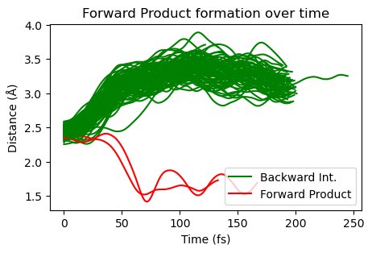
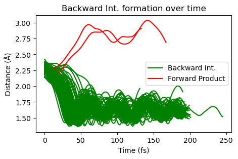
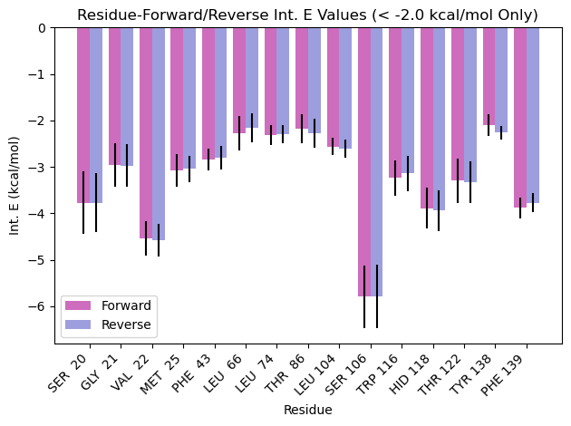
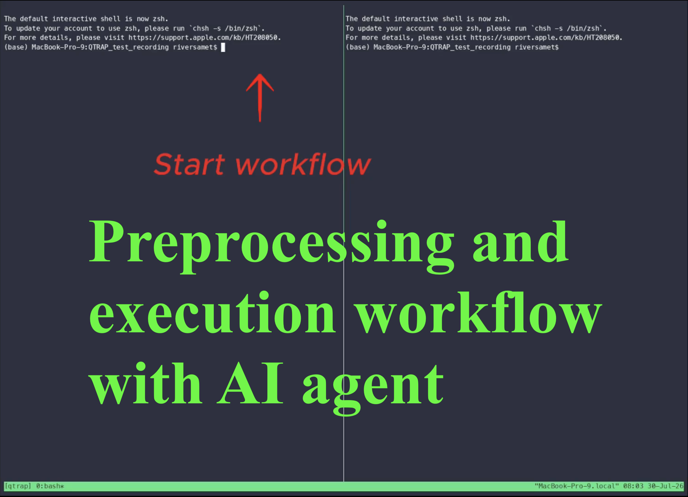
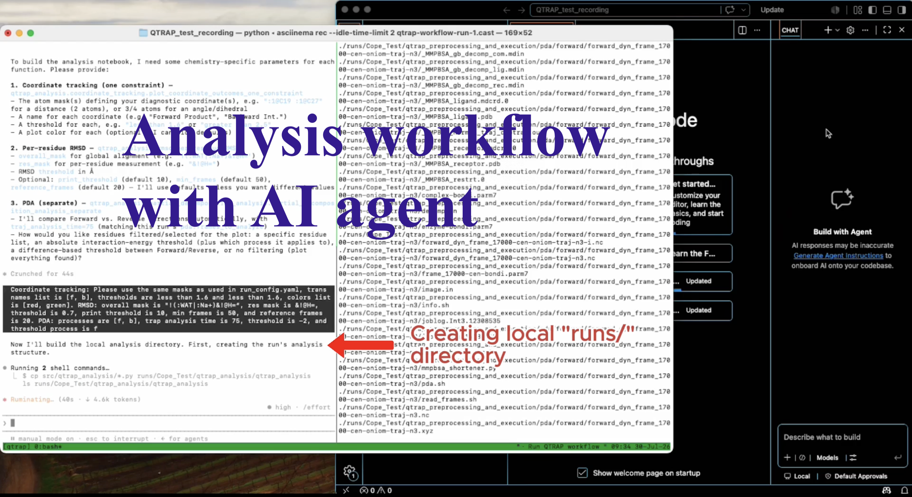

# QTRAP

## Summary

Quantum mechanics/molecular mechanics Trajectory Running, Analysis, and Preprocessing (QTRAP) is a workflow designed to automate quasiclassical quantum mechanics/molecular mechanics (QM/MM) dynamics simulations. There are two key, distinct components of this repository: the newly-developed QM/MM dynamics workflow with associated scripts for automation of individual processes within the procedure, and the materials required for an artificial intelligence (AI) agent to be able to interactively or independently run the entire workflow on its own, with minimal input from the user. No automated workflow for quasiclassical QM/MM dynamics simulations has been published before (that the author could find as of July 2026); in fact, quasiclassical QM/MM dynamics simulations are used infrequently in the first place, yet they are able to provide valuable information regarding femtosecond-scale dynamic processes within ligand-receptor systems that can help researchers better understand complex biochemical processes.

## Table of Contents

- [Summary](#summary)
- [Component 1: QM/MM dynamics workflow](#component-1-qmmm-dynamics-workflow)
  - [Requirements](#requirements)
  - [Part 1: Preprocessing and execution](#part-1-preprocessing-and-execution)
  - [Part 2: Analysis](#part-2-analysis)
  - [Examples](#examples)
- [Component 2: Agentic workflow](#component-2-agentic-workflow)
  - [Starting the agentic workflow](#starting-the-agentic-workflow)
  - [`agent/` file descriptions](#agent-file-descriptions)
  - [Agentic workflow in action](#agentic-workflow-in-action)
- [Limitations](#limitations)
- [Importance](#importance)
- [Conclusions](#conclusions)
- [Credits](#credits)
- [Contact](#contact)
- [References](#references)

## Component 1: QM/MM dynamics workflow

The QM/MM dynamics workflow provided here is broken down into two key parts: preprocessing and execution, and analysis. Preprocessing and execution converts a raw molecular dynamics (MD) simulation (composed of a NetCDF file and associated topology file) into completed QM/MM dynamics trajectory runs and associated partial decomposition analysis files for each run (if requested). This is run on a remote HPC cluster due to heavy computational dependencies -- specifically UCLA's Hoffman2 cluster, in this case. Adapting this to another HPC cluster would require editing multiple scripts along this preprocessing and execution workflow.

Analysis refers to the process of taking these output files and analyzing coordinates of interest over time during trajectories (i.e., a reaction coordinate), conducting per-residue RMSD analysis for each trajectory, and/or displaying results from partial decomposition analysis completed in the preprocessing and execution phase. This is completed locally due to light computational dependencies.

All scripts and documentation provided for this workflow can be found in `src/`.

### Requirements

Running the full workflow depends on the following, most of which are only needed on the HPC cluster side:

- **Amber / AmberTools** -- tleap, antechamber, cpptraj, and MMPBSA.py are used throughout preprocessing, execution, and PDA.
- **Gaussian** -- used for all ONIOM (QM/MM) optimizations and frequency calculations.1
- **Progdyn** -- Daniel Singleton's quasiclassical/classical dynamics engine (see Credits); this workflow depends on a manually modified version, not the unmodified upstream release.2
- **pdb2oniom** (BILAB) -- used to help build ONIOM input files from PDB structures (see Credits).3
- **Python 3**, with the packages in `requirements.txt` installed (`pip install -r requirements.txt` -- covers NumPy, Matplotlib, pandas, Jupyter, and mdtraj) plus `pytraj`, which is not a standard pip package. `pytraj` ships as part of AmberTools and is normally installed via a conda environment (e.g., `conda install -c conda-forge ambertools`) rather than pip.
- **Access to an SGE-based HPC cluster** -- UCLA's Hoffman2 cluster specifically, as written; adapting to another cluster requires editing the scripts that call `qsub`/`qstat`/`qacct`-style commands directly.
- **Claude Code** (CLI) -- only required for the agentic workflow (Component 2); the manual workflow (Component 1) has no dependency on it.

### Part 1: Preprocessing and execution

Preprocessing and execution is divided into 10 distinct steps, with an additional `pda` step for optional partial decomposition analysis of trajectories. An additional directory called `start_files/` also exists, which contains the initial input files. Below are descriptions of each step/directory, and what is specifically done to achieve the goal of that step (when applicable). Much of this workflow is based on the work of Yang et al.4

Note that some of these steps may not be necessary for you (maybe you already have .rst files for the frames you would like to run dynamics calculations on, maybe you already have solvated complex structures, etc.). You may skip steps as necessary, but be mindful of naming conventions that are often hardcoded in scripts -- you may need to edit scripts on your own if your naming conventions differ when you skip steps. When no steps are skipped, naming conventions hardcoded into scripts always work.

Please check individual scripts for their respective options and flags.

#### `start_files/`

`start_files/` should be populated with the initial MD simulation data (the NetCDF and associated topology files). Nothing is actually completed in this directory; it is simply helpful for reference and organization (but optional to use when running the QTRAP workflow manually). The `INITIATE.md` file in this directory describes the purpose of `start_files/`.

#### `step0/`

With the proper MD simulation files copied to this directory from `start_files/`, the purpose of this step is to create .pdb files for each frame along the MD simulation that the user would like to eventually run QM/MM dynamics on. Any number of frames can be chosen. First, `extract_restart_frames.sh` extracts .rst files for each frame of interest within the MD simulation, and then `convert_restarts_to_pdb.sh` converts each of these .rst files to .pdb files using the associated topology file within the directory. `convert_restarts_to_pdb.sh` requires the use of a compute node on the UCLA-based Hoffman2 HPC cluster, so the user must request this in order to complete this step (if using Hoffman2).

#### `step1/`

The .pdb files created from `step0/` should be copied to this directory. The purpose of this step is to order residues within each .pdb file. The ligand may be located at any position in the overall residue order in the MD simulation files, but for QM/MM using the Progdyn software created by Singleton and coworkers,2 the ligand (the QM part of the QM/MM simulation) must be located in the first position in the overall residue order. `reorg.py` reorders the .pdb files, wrapped by `reorg.sh` to reorder files in batch. Note that `reorg.py` requires installation of the `pytraj` package in Python.

#### `step2/`

The reordered .pdb files from `step1/` should be copied to this directory. This step has two aims: to parametrize the ligand residue, and to solvate the ligand-receptor complex. `extract_ts.sh` is used to parametrize the ligand, while `parametrize_and_solvate.sh` and `leap.in` are used to solvate the complex. All of these require the Amber software package; `extract_ts.sh` uses the antechamber function in Amber, while `leap.in` is run using the tleap function. Both require a compute node on Hoffman2.

#### `step3/`

The solvated complex-containing .pdb files from `step2/` should be copied to this directory. Step 3 is used to strip solvent molecules far away from the complex, and also strip all ions that were used for charge balance. You may select the distance away from the complex that solvent molecules are removed. `strip.in` is used as input for cpptraj run in batch in `strip_solvent_and_ions.sh`.

#### `step4/`

The stripped .pdb files from `step3/` should be copied to this directory. Step 4 is used to center the complex, and build the proper topology and coordinate files required for the next step. `leap.in` (not the same `leap.in` used in step 2) is used to center the complex and create the coordinate and topology files, which is wrapped in `center.sh` for batch operations. This process, yet again, requires a compute node on Hoffman2.

#### `step5/`

The centered coordinate, topology, and .pdb files from `step4/` should be copied to this directory. Step 5 is used to build QM/MM input files for Gaussian that will then be used to find the optimized ligand structure within the complex. Finding the optimized ligand structure within the complex is essential for consolidating the imaginary frequencies within the complex down to just one (the reaction coordinate). Without optimization, multiple imaginary frequencies in the complex likely exist, preventing sampling along the proper imaginary frequency (the reaction coordinate) from occurring properly, and leading to physically unreasonable and useless dynamics results.

This step requires installation of the `pdb2oniom` package developed by BILAB (see Credits).3 `base_oniom_file_builder.sh` is used to build a base QM/MM input file for Gaussian using the provided coordinate and topology files with the proper options. These QM/MM input files are called Our own N-layered Integrated molecular Orbital and Molecular mechanics (ONIOM) input files, a method originally developed by Morokuma and coworkers.5 `generate_oniom_input_files.sh` executes `base_oniom_file_builder.sh`, and is used to build finalized ONIOM input files for this project. Many options are present in this script, including the option of freezing certain coordinates in optimization (using `freeze_coords.py` and `frozen.txt` as input), keeping all low-level (calculated using MM) atoms rigid (using `rigid_low_level.py` for execution wrapped in `rigid_batch.sh`), running guess=mix calculations useful for radical systems, and other options as well. Please check the script for complete documentation. Additionally, `corelist.txt` must be provided as input for ONIOM input file creation. All scripts within this directory operate within `generate_oniom_input_files.sh`, which is the only script that needs to be run by the user.

#### `step6/`

The ONIOM input files from `step5/` should be copied to this directory. Step 6 is used to queue all ONIOM jobs, and then, once complete, provide a list of jobs that have been transferred to the next step following their success, jobs that now have all coordinates unfrozen after being run with frozen coordinates previously, and jobs that failed and must be run again. `Gsub.py` is a UCLA-made script (not created by the owner of this repository) used to queue Gaussian jobs on the Hoffman2 HPC cluster. `file_builder_job_status.sh` is used to

    a. check all .out files for success with all unfrozen coordinates, success with frozen coordinates, or failure,
    b. copy all .out files that terminated successfully with no frozen coordinates to the next directory `step7/`,
    c. create new continuation input files with no frozen coordinates for jobs that had previously had frozen coordinates (using `remove_frozen_coords.py` and `frozen.txt` as input),
    d. create continuation input files with the same route section for jobs that terminated with error, and
    e. print lists to the user describing what was done for each .out file initially in the directory.

Only `file_builder_job_status.sh` should be run from this directory by the user.

#### `step7/`

All successfully-terminated output files from `step6/` should already be copied to the `step7/` directory per `file_builder_job_status.sh` from step 6. The purpose of step 7 is to run single-point frequency calculations using the Gaussian keyword `freq=hpmodes` for all structures (required for Progdyn dynamics calculations), and then analyze the termination status of each job and proceed accordingly. `generate_hpmodes_spfreq_files.sh` is used to build single-point frequency ONIOM input files from each ONIOM output file copied to `step7/` from `step6/`. `file_builder_job_status_spfreq.sh` is used to

    a. check all files for termination success or failure,
    b. copy all .out files that terminated successfully to the next directory `step8/`,
    c. create continuation input files with the same route section for jobs that terminated with error, and
    d. print lists to the user describing what was done for each .out file initially in the directory.

#### `step8/`

All successfully-terminated output files from `step7/` should already be copied to the `step8/` directory per `file_builder_job_status_spfreq.sh` from step 7. The purpose of step 8 is to revise any frequency over 0 cm-1 and under 100 cm-1 to exactly 100 cm-1 to prevent anharmonicity. `revise_frequencies.py` is used to edit the values of these low-frequency modes in a given .out file, wrapped by `revise_frequencies_batch.sh` for batch operations on multiple .out files.

#### `step9/`

All .out files with revised frequencies from `step8/` should be copied to this directory. The purpose of step 9 is to create two new files associated with each .out file -- AtomAmber and methodfile -- which are essential for QM/MM dynamics using Progdyn. A directory for each .out file is built, containing the .out file, its associated .com file, and the two new files generated using `generate_aux_files_progdyn.py`. The resulting directories are then automatically copied to `step10/`. All of this is done using `generate_aux_files_progdyn_batch.sh`.

#### `step10/`

All directories containing the necessary input files for step 10 are automatically copied from `step9/` using `generate_aux_files_progdyn_batch.sh`. The purpose of step 10 is to run QM/MM dynamics calculations using Progdyn. Before running any scripts, `proganal` and `progdyn.conf` must be filled out in their entirety, with the proper options for this specific dynamics run. For more information, please check the Progdyn documentation.2

This is a good place to note a very important point about running these dynamics: the original Progdyn scripts were manually edited to allow this workflow to run successfully. The exact edits made will likely be published with the rest of this repository soon, but are not publicly available yet; please reach out to the repository owner with any questions.

First, `sort_forward_reverse_dirs.sh` is used to create `forward_dyn/` and `reverse_dyn/` directories with copies of the `step9/`-copied directories in each, and the `searchdir` option in `progdyn.conf` switched from positive to negative in `reverse_dyn/` for propagation of trajectories along both directions of the reaction coordinate. Then, `qmmm_dyn_prep.sh` is used to queue trajectory calculations. This should be run in both `forward_dyn/` and `reverse_dyn/`. Some options for trajectory calculations are hardcoded in `qmmm_dyn_prep.sh`; edit this script should you wish to change them. `makedynjobnew` is a UCLA-created script (not created by the repository owner) used to queue jobs for Progdyn. It was edited slightly for this project.

Following completion of dynamics calculations, `sort_trajs.sh` is used to place all trajectory calculations into one `trajs/` directory, with naming conventions that are unique to each individual trajectory run, so no files are overwritten.

#### `pda/`

Partial decomposition analysis (abbreviated PDA in this project) can also be done using this workflow. PDA jobs must be completed before any PDA analysis can be done, however. This directory has many scripts; check `WORKFLOW.md` for a simplified step-by-step guide for how a user should run calculations. Three scripts need to be run by the user:

- Before running any scripts, copy all topology files from `step5/` to this directory. They are necessary for these calculations.
- `generate_ligand_enzyme_complex_parm.sh` -- used to generate topology files for the lone ligand, the lone receptor, and the lone complex (no solvent). Necessary for PDA calculations.
- `prepare_and_queue_all_pda_jobs.sh` -- creates `forward/` and `reverse/` directories and copies all necessary files from `step10/` into them, as well as the necessary scripts (using `get_traj_files.sh`), converts XYZ trajectory files into NetCDF files (using `xyz_to_nc_converter.py`), creates Bondi-radii topology files (avoids errors that can occur without this step; uses `bondi_radii.sh`), and creates directories for each trajectory within `forward/` and `reverse/` to house PDA results with all proper files included for job submission, then queues jobs on Hoffman2 (using `queue_pda_jobs.sh` with `pda.sh` as the script for actual job submission). `read_frames.sh` is a simple script used to calculate the number of frames in a trajectory; it's used within `prepare_and_queue_all_pda_jobs.sh`. `decomp.in` and `image.in` templates are provided for PDA runs; `image.in` is automatically edited using the previous scripts. Amber's MMPBSA.py is used to run PDA.
- `sort_pda_results.sh` -- produces a shortened MMPBSA output file with PDA results (the original is quite large) using `mmpbsa_shortener.py`, then copies all results files to the `data/` directory with a unique name for each results file based on its original file path.

PDA analysis can also be conducted with MD files as input -- template `decomp.in` and `image.in` files specifically for PDA with MD are included in this repository. Queueing MD-based PDA jobs on Hoffman2 is far simpler than for QM/MM -- create the proper topology files using `generate_ligand_enzyme_complex_parm.sh`, then place all MD files into a directory and run `pda.sh` there after manually editing options in that script. You may create a shortened results file with `mmpbsa_shortener.py`.

### Part 2: Analysis

Following the creation and execution of all jobs for QM/MM dynamics (including PDA jobs, if necessary; also including MD-based PDA jobs if run), analysis of results can be completed using the `qtrap_analysis` portion of this workflow. Three kinds of analysis can be conducted: coordinate tracking (i.e., the reaction coordinate), per-residue RMSD analysis (more information below), and residue and structure comparisons based on PDA results.

#### Coordinate tracking

Coordinate tracking refers to plotting specific masks (bonds, angles, or dihedrals) from the given ligand (and/or receptor) over time. This is typically used to track a reaction coordinate over time, and determine when and if a certain product or reactant is formed. Because structure formation can depend on one coordinate or on multiple (e.g., two dihedrals together decide whether a reactant or product has formed, not either alone), two functions are provided to handle both cases:

- `plot_coordinate_outcomes_one_constraint` -- used when a single coordinate or mask determines structure formation. Since only one coordinate is used to determine whether a structure has formed, a list of many different masks can be used, along with their associated thresholds for formed structures and structure names, to determine whether a trajectory has gone to any one of many different products. This is especially useful when a structure may bifurcate to multiple different products. Please check the docstrings for all functions for more information about inputs.
- `plot_coordinate_outcomes_multi_constraint` -- used when multiple coordinates or masks must be used together to determine structure formation. In this case, the masks required for the "forward" and "backward" structures are given, and the function determines whether either structure forms based on the multiple constraints required for formation in each case. With only two directions included as input, this function is unable to identify the formation of more than two structures at once.

#### Per-residue RMSD

Per-residue RMSD is a more complex and unusual analytic technique than the others used here. Essentially, each trajectory run is screened for residues that have an RMSD value greater than a certain `threshold` when the final `reference_frames` are compared to the first `reference_frames`. Each time a residue exceeds this threshold in a trajectory, it is flagged, and a final plot showing the number of times each residue exceeded the RMSD threshold across all trajectories analyzed is printed, for residues that exceeded the threshold more than zero times. This is useful for determining whether specific residues undergo large conformational or spatial shifts as the docked ligand moves along a reaction path. Residues that consistently undergo large shifts as the ligand moves along the reaction path may indicate high importance in enzymatic catalysis (potential causation of increased reactivity by geometric residue shifts); this information can help researchers better understand enzymatic processes from a dynamic standpoint, and predict and design new enzymatic reactions in the future.

#### Partial decomposition analysis

Two different functions for partial decomposition analysis exist here: one to compare residue-ligand interaction energies separately between structures analyzed (`partial_decomposition_analysis_separate`), and one to compare residue-ligand interaction energies summed by structure (`partial_decomposition_analysis_combined`). The former can take input as either QM/MM trajectories or MD trajectories; the latter only takes MD trajectories as input.

- `partial_decomposition_analysis_separate` -- this analysis can highlight residues that are especially important for stabilizing ligand binding, as well as the residues that have the largest changes in ligand stabilization as the ligand proceeds along a reaction coordinate. The function generates a bar chart grouped by residue ID showing residue-ligand interaction energies for multiple processes.
- `partial_decomposition_analysis_combined` -- this function compares summed residue-ligand interaction energies between processes. Each process is plotted as a stacked bar, and each residue's contribution is shown with a different color. The main difference from the previous PDA function is that this plot emphasizes the total stabilizing interaction energy for each process, while the previous function compares individual residue interaction energies between processes.

### Examples

Please see `notebooks/QTRAP_analysis_example.ipynb` for examples of analysis function usage. Two are provided below as well.

#### Coordinate tracking: one-constraint outcome classification

Plots of two different bond lengths (composing the reaction coordinate) vs. time for many trajectories propagated in one direction along the reaction coordinate.

*In this simple case, all trajectories are assigned to either the forward product or backward intermediate based on the diagnostic distances. More complex QM/MM dynamics simulations may require multiple coordinates at once to classify a trajectory outcome reliably.*

#### PDA: absolute interaction energy-based filtering

This function compares residue-ligand interaction energies from Amber `MMPBSA.py` PDA outputs. This analysis can highlight residues that are especially important for stabilizing ligand binding, as well as the residues that have the largest changes in ligand stabilization as the ligand proceeds along a reaction coordinate.

*Energies are grouped by residue ID so that residue-specific interaction energies can be compared directly between processes. Standard deviations are included to show variability across trajectories.*

A link to a video provided under the "Agentic workflow in action" section displays an AI agent running some steps along the preprocessing and execution workflow. Please reach out to the repository owner with any questions, or if you would like guidance on any step along this workflow. Also, feel free to ask the AI agent for guidance; it should be able to provide a high level of detail for each step in this workflow.

## Component 2: Agentic workflow

Along with the QM/MM dynamics workflow described above, scripts and documentation are provided in this repository so that an AI agent is able to complete this entire QM/MM dynamics workflow interactively or independently. All of the preprocessing, execution, and analysis scripts and procedures described above are used by the agent, with the addition of some functions and documentation that are helpful for efficient and safe agent behavior. Almost all of this is contained in `agent/`.

The agent is able to take a directory containing `src/`, `notebooks/`, `agent/`, and `.claude/` locally and run the entire preprocessing and execution workflow remotely on the Hoffman2 HPC cluster, then conduct all analysis locally. It prompts the user at certain points when necessary, but only for information that only the user knows. Otherwise, it can complete the entire workflow independently. The agent should be able to complete much if not all of the workflow in headless mode, but this has yet to be fully tested. Please read `CLAUDE.md` for explicit documentation on the agent's procedures.

### Starting the agentic workflow

Before beginning the agentic workflow, the user must copy `.env.example` to `.env` and fill it out properly, and also copy `run_config.example.yaml` to `run_config.yaml` and fill it out properly as well. The user may leave one field blank in `run_config.yaml`: `step5.freeze_coordinates`, because oftentimes the user may not know the exact atom numbering required for this field until after some of the workflow has been completed. Please see below for more information on this field.

To start the agentic workflow, simply obtain the path to `start.sh` and run `bash /path/to/start.sh`. Claude Code will launch a new session, and you will see the workflow being completed step by step by the agent, which may prompt the user for certain information as necessary. To run in headless mode, simply include the `--headless` flag after `bash /path/to/start.sh`.

### `agent/` file descriptions

Below are descriptions of each file in `agent/`, as well as `.claude/settings.json`, `.claude/settings.local.json`, and `.gitignore`.

#### `.claude/settings.json` and `.claude/settings.local.json`

`.claude/settings.json` denies many potentially harmful permissions, allows some essential permissions outright, and requests all other permissions as needed -- the same location, file name, and general contents used by other agentic workflows built with Claude Code. `.claude/settings.local.json` holds project- and session-specific permission approvals and is not meant to be shared or committed; it is listed in `.gitignore` (see below) for anyone adapting this repository for their own use.

#### `.gitignore`

Keeps real credentials (`agent/.env`), run-specific configuration data (`agent/run_config.yaml`), generated run data (`runs/`), session-specific settings (`.claude/settings.local.json`), project-specific starting structures, and OS/editor/Python junk files out of version control, while still tracking the directory structure and templates needed to reuse the workflow.

#### `scripts/check_start_files.sh`

Verifies a run's starting structure files exist and match before preprocessing begins. If the topology and trajectory are incompatible, exits with a clear error instead of failing later in the workflow.

#### `scripts/conf_fill.sh`

Fills in `progdyn.conf`'s per-run placeholders. Many options must be chosen; some are automatically taken from prior steps in the workflow, many others are taken from `run_config.yaml`, and some are hardcoded into the `progdyn.conf` template (those that are rarely altered).

#### `scripts/queue_pda_jobs_md.sh`

Runs partial decomposition analysis on one MD trajectory. This is easily done manually by the user when completing the workflow without the agent (described in detail in the `pda/` section), but a script is provided for the agent so that it does not make mistakes by relying solely on memory and user instruction.

#### `scripts/submit_oniom_batch.sh`

Batch wrapper for `Gsub.py`. Submits one or more Gaussian input files as Hoffman2 (SGE) jobs.

#### `tools/copy_files.sh`

Moves files between the local machine and the cluster, or inspects a remote path. Remote paths are checked against `REMOTE_BASE_DIR` and refused if they resolve outside it. `get`/`put`/`copy` use `-r`, so they work on whole directories as well as single files. One of three primary tools that the agent has access to.

#### `tools/job_status.sh`

Checks the status of a submitted SGE job on Hoffman2. `qstat` reports queued or running jobs; `qacct` reports finished jobs, including exit status and actual runtime (used to tell a walltime kill apart from a real failure). One of three primary tools that the agent has access to.

#### `tools/run_remote.sh`

Runs an allowed workflow script on Hoffman2 over SSH. Scripts run from either the active run directory or from the `agent/` directory. This script is helpful for safely enacting this agentic workflow on a secure cluster where many users keep valuable information and research findings. Allowing only this tool to run a user-selected set of scripts prevents the agent from having the autonomy to execute a variety of actions that could have negative consequences (other scripts with commands like `rm` are blocked, which prevents issues such as accidental file deletion). One of three primary tools that the agent has access to.

#### `.env.example`

An example of how the user should fill out `.env`. The user should copy `.env.example` to `.env`.

`.env` should contain paths noting the base directories for agent operation on both the local device and the remote cluster. It should also contain the flags necessary for the agent to request the proper compute node on the remote cluster for certain steps along the preprocessing and execution workflow.

#### `CLAUDE.md`

Instructions used by the agent to execute the QTRAP workflow. This file is always provided for agentic workflows using Claude Code, and always contains instructions for the agent. More detail about each step along the agentic workflow is given in this file.

#### `lessons.md`

A file edited by the agent after interaction with the user regarding job failures. If the user describes a specific type of job failure and its fix to the agent, the agent documents it in `lessons.md`. If the agent then encounters the same issue again, it can fix it independently. The agent consults this file before the start of every run. One bullet is used to document each lesson from the user.

The user could theoretically edit this file as well, to prepare for potential issues the agent may come across, so that the agent solves these issues independently the first time. An example might be a link 9999 error occurring in a certain job, where the user notes that more memory must be provided to fix it.

#### `run_config.example.yaml`

An example of how the user should fill out `run_config.yaml`. The user should copy `run_config.example.yaml` to `run_config.yaml`. All fields except one are required to be filled out prior to agentic workflow execution; the agent will stop if other parameters in `run_config.yaml` are missing.

Only `step5.freeze_coordinates` may be left blank when starting the agentic workflow. This is because atom reordering/renumbering occurs during the preprocessing and execution workflow, so the user may not initially know the exact atom IDs comprising the bonds, angles, and/or dihedrals that make up the reaction coordinate (these specific bonds, angles, and/or dihedrals are the input for `step5.freeze_coordinates`). Of course, if the user does know them beforehand, they may include them in `run_config.yaml` -- but if not, the agent will provide one example ONIOM input structure to the user during step 5 of the preprocessing and execution workflow, so the user can determine the atom IDs that should be present in `step5.freeze_coordinates`; a description of the specific bonds/angles/dihedrals that should be frozen can then be given to the agent, and the agent will fill out this piece of `run_config.yaml`. No other part of `run_config.yaml` may be edited by the agent.

Additional parameters may be requested by the agent; these are not stored in a file, only in the agent's memory -- less reliable in general, but fine when the agent asks for parameters and uses them directly in the next step it executes (such as specific analysis types and parameters for QTRAP analysis).

#### `start.sh`

Entry point for the QTRAP agent. Runs Claude Code with `CLAUDE.md` as context and the tools in `agent/tools/` as its only means of acting on the cluster. Allows this workflow to be run in headless mode as well as interactive mode. While `run_config.yaml` is checked by the agent, `.env` is checked by `start.sh`, and the script will exit with an error if `.env` has any fields left blank.

### Agentic workflow in action

To demonstrate the agent's capabilities, two links to brief videos are provided below. The first video shows the first few steps of the preprocessing and execution workflow being completed by the agent, and the second shows a Jupyter notebook for analysis being prepared by the agent so that the user may run it (similar to `QTRAP_analysis_example.ipynb`). Another video of the agent running the entire preprocessing and execution workflow may be uploaded at a later date; the author has already tested the agent's ability to run the entire preprocessing and execution workflow numerous times with success.

## Limitations

QTRAP-based dynamics calculations (and quasiclassical QM/MM dynamics simulations in general) work quite well and provide useful, physically-reasonable data for well-defined transition states with large imaginary frequencies, but the repository owner's own research has shown large difficulties in running these simulations properly for transition states with small imaginary frequencies. This is not necessarily a limitation of QTRAP specifically, but of quasiclassical QM/MM dynamics calculations in general.

There are no real limitations of QTRAP when compared to running quasiclassical QM/MM dynamics with any other workflow. The main limitations are those of the agent; the way the agent handles checking on job submissions, running MD-based PDA calculations, and executing the workflow for multiple different structures (runs) at once need further testing and likely some improvements.

Right now, when all jobs are submitted for a run, the agent simply reports the status of each job to the user, then waits until the user provides input before doing anything else. In interactive mode, this is generally fine: the user may exit the session, then resume with the proper session ID when jobs are complete. In headless mode, however, the agent will simply exit the session without saving the session ID and without input from the user. This means resuming the session is likely not possible, which takes away much of the point of headless mode -- the user must instead provide input during the agent's execution of the workflow for it to be completed. A workaround so that the session ID is saved in headless mode, and the session automatically being resumed once jobs are complete, is currently being developed but has not yet been implemented.

MD-based PDA calculations have not yet been tested using the agentic workflow. The author hypothesizes few to no issues with this process, but it should be made clear to the user that unforeseen challenges may arise (however unlikely).

The workflow has also not yet been tested with multiple starting structures across multiple runs. The agent should be able to complete multiple runs within the same session with ease, based on the clear instructions in `CLAUDE.md`, but issues may arise due to the higher complexity of this process -- particularly around switching between runs as jobs are submitted and completed.

The `plot_coordinate_outcomes_multi_constraint` analysis function may also be updated to allow for more than two structures to be identified at once in plotted results, although this would greatly increase the complexity of inputs for this function, which are already complex as-is. The repository owner may or may not provide this functionality in the future.

The agentic workflow has very clear, explicit instructions for every step in the workflow, which prevents misinterpretation of the desired procedure, but reduces the user's freedom to customize the agent's process. Editing `CLAUDE.md` and `.claude/settings.json` can counteract this, if desired.

Additionally, the exact edits made to the Progdyn scripts in order to run QM/MM dynamics calculations are not currently published, but will likely be distributed soon.

## Importance

This workflow greatly increases the efficiency of running and analyzing highly complex quasiclassical QM/MM dynamics calculations. The author's first attempt at running and analyzing these calculations took weeks (including research into good practices for physically reasonable results), while this workflow can be completed in about an hour or less by the AI agent (excluding job completion times, which can range from minutes to about a day).

Quasiclassical QM/MM dynamics calculations are valuable for gaining insight into the femtosecond-scale dynamics of enzymatic processes, which can help reveal the exact mechanisms by which products are formed, and the specific regions or residues of an enzyme that are especially important in catalysis, and why (hydrogen bonding, transfer of vibrational energy, etc.).4

## Conclusions

Quasiclassical QM/MM dynamics calculations are valuable for the analysis of femtosecond-scale dynamic processes in biological molecules, but are extremely complicated to prepare and run, and lack a general, well-documented, agreed-upon, and user-friendly procedure for their execution. Herein, the author provides a detailed procedure, checked and validated by doctoral candidates and postdoctoral scholars, for running these kinds of simulations. The workflow provided dramatically reduces the time required to prepare and analyze these calculations, making them more accessible to researchers. The agentic workflow increases efficiency further, and lets a user learn as they go -- an attribute not present in many similar procedures for computational chemistry or biology simulations. Granted, this workflow is not a widely agreed-upon procedure (yet), but it is one of the more detailed and explicit ones published for these kinds of simulations.

Many improvements to the workflow may be implemented in the future, especially those addressing the limitations described above. Please check back here regularly for updates.

Results acquired using this workflow have helped the author and adjacent researchers gain insight into new, complex enzymatic processes. Details are not divulged here for privacy reasons.

## Credits

This workflow depends directly on several tools not created by the owner of this repository:

- **Progdyn**, developed by Daniel Singleton and coworkers (Texas A&M University) -- the quasiclassical/classical dynamics engine used in `step10/` to propagate the QM/MM trajectories.2 A manually modified version is used here; the modifications are not yet published (see `step10/` above).
- **pdb2oniom**, developed by BILAB -- used in `step5/` to build ONIOM (QM/MM) input files from .pdb structures.3
- **Gsub.py** and **makedynjobnew**, UCLA-created scripts (Hoffman2 cluster) used to queue Gaussian and Progdyn jobs, respectively -- not created by the owner of this repository. `makedynjobnew` was edited slightly for this project by the repository owner.
- **AmberTools** (tleap, cpptraj, antechamber, MMPBSA.py) and **Gaussian** -- the underlying classical and quantum mechanical engines this workflow uses throughout preprocessing, execution, and PDA.

## Contact

Please reach out to the repository owner with any questions about this workflow.

## References

1. Frisch, M. J.; Trucks, G. W.; Schlegel, H. B.; Scuseria, G. E.; Robb, M. A.; Cheeseman, J. R.; Scalmani, G.; Barone, V.; Petersson, G. A.; Nakatsuji, H.; Li, X.; Caricato, M.; Marenich, A. V.; Bloino, J.; Janesko, B. G.; Gomperts, R.; Mennucci, B.; Hratchian, H. P.; Ortiz, J. V.; Izmaylov, A. F.; Sonnenberg, J. L.; Williams-Young, D.; Ding, F.; Lipparini, F.; Egidi, F.; Goings, J.; Peng, B.; Petrone, A.; Henderson, T.; Ranasinghe, D.; Zakrzewski, V. G.; Gao, J.; Rega, N.; Zheng, G.; Liang, W.; Hada, M.; Ehara, M.; Toyota, K.; Fukuda, R.; Hasegawa, J.; Ishida, M.; Nakajima, T.; Honda, Y.; Kitao, O.; Nakai, H.; Vreven, T.; Throssell, K.; Montgomery, J. A., Jr.; Peralta, J. E.; Ogliaro, F.; Bearpark, M. J.; Heyd, J. J.; Brothers, E. N.; Kudin, K. N.; Staroverov, V. N.; Keith, T. A.; Kobayashi, R.; Normand, J.; Raghavachari, K.; Rendell, A. P.; Burant, J. C.; Iyengar, S. S.; Tomasi, J.; Cossi, M.; Millam, J. M.; Klene, M.; Adamo, C.; Cammi, R.; Ochterski, J. W.; Martin, R. L.; Morokuma, K.; Farkas, O.; Foresman, J. B.; Fox, D. J. *Gaussian 16*, Revision A.03; Gaussian, Inc.: Wallingford, CT, 2016.
2. Singleton, D. A. *Progdyn* [Computer software]. https://github.com/DanielSingleton/Progdyn (accessed Jul 31, 2026).
3. BILAB. *pdb2oniom*, version 0.3.2 [Computer software]. https://github.com/BILAB/pdb2oniom (accessed Jul 31, 2026).
4. Yang, Z.; Yang, S.; Yu, P.; Li, Y.; Doubleday, C.; Park, J.; Patel, A.; Jeon, B. S.; Russell, W. K.; Liu, H.-W.; Russell, D. H.; Houk, K. N. Influence of Water and Enzyme SpnF on the Dynamics and Energetics of the Ambimodal [6+4]/[4+2] Cycloaddition. *Proc. Natl. Acad. Sci. U.S.A.* **2018**, *115* (5), E848–E855.
5. Svensson, M.; Humbel, S.; Froese, R. D. J.; Matsubara, T.; Sieber, S.; Morokuma, K. ONIOM: A Multilayered Integrated MO + MM Method for Geometry Optimizations and Single Point Energy Predictions. A Test for Diels–Alder Reactions and Pt(P(t-Bu)3)2 + H2 Oxidative Addition. *J. Phys. Chem.* **1996**, *100* (50), 19357–19363.
